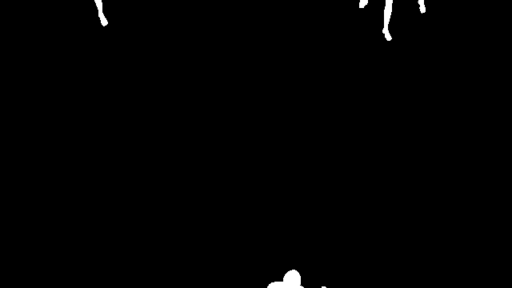
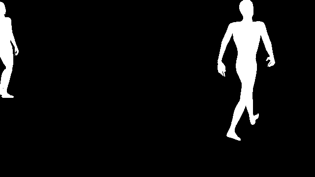

# Silhouette Anomaly Detection
A repository around the idea of using synthetic silhouettes generated from Unity of pedestrians for a train anomaly detection model

## Synthetic data generation
Synthetic data is generated using the Unity game engine. To generate your own data clone the repository and open the Unity project. 

- The project requires Unity 2022 or later
- The project requires HDRP and the Perception Package
- Just start the Unity project and press play - 30 sequences will be generated from 58 cameras of pedestrian mannequins walking
- The frame sequences will be saved in your Documents folder

Once the sequences are generated, run the Python script called **post_process_trainData.py**, and in the script, change the directory of your raw training data, as well as where you want the processed data to be saved.

   

## Requirements
Check out the requirements.txt file for more information. You will need to install ultralytics and SAM for pre-processing the testing data from the real datasets

## Training model

To train the model called **model_lstm_unet.py** you need to run **train_synth_sillhuette.py**, and in the script, change the directory to the processed synthetic data, as well as the directory where the model_checkpoints will be saved.

## Testing

You will need to first pre-process the testing real datasets to create segmentation masks. To do this, you run **make_sillhuettes.py** and point to your dataset and set where the processed masks will be saved. Currently, the code has been tested with PED2, Avenue and ShanghaiTech datasets. 

To evaluate the trained model, you can call **evaluate.py** and change the directory to the testing data and model checkpoint.

